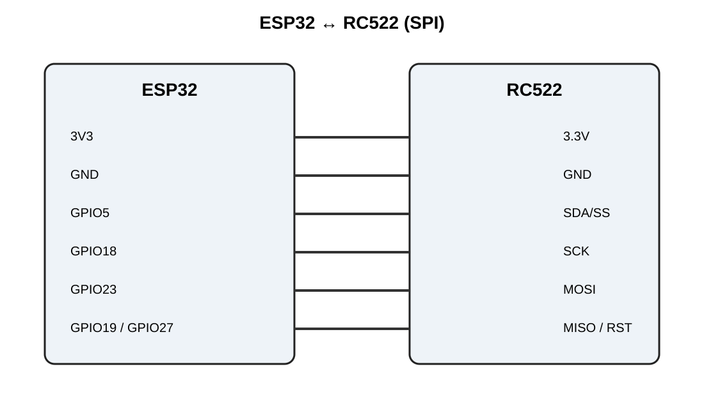
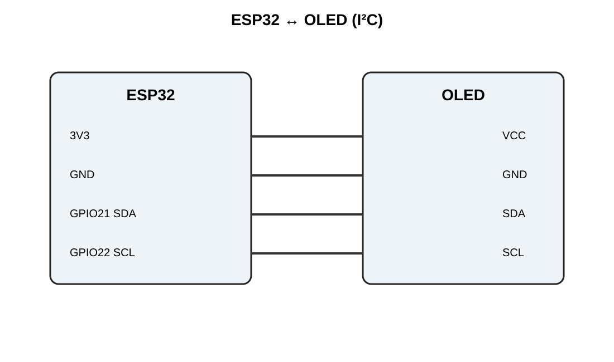
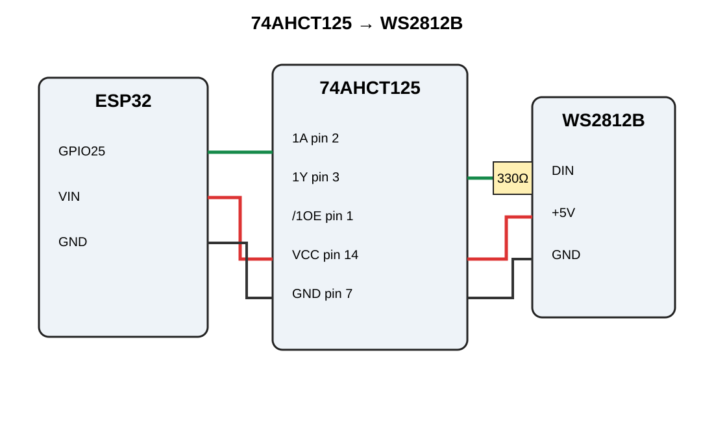
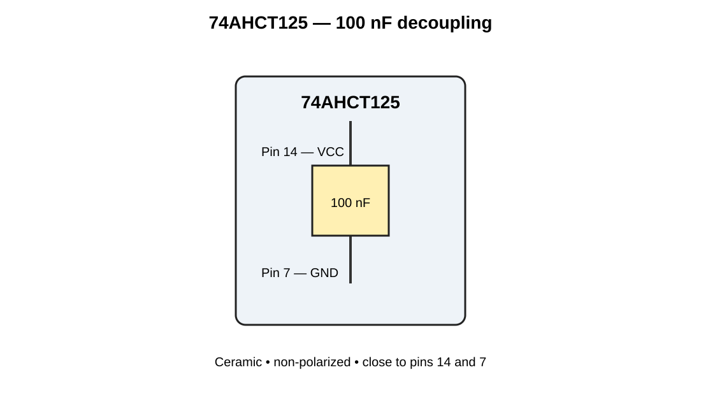
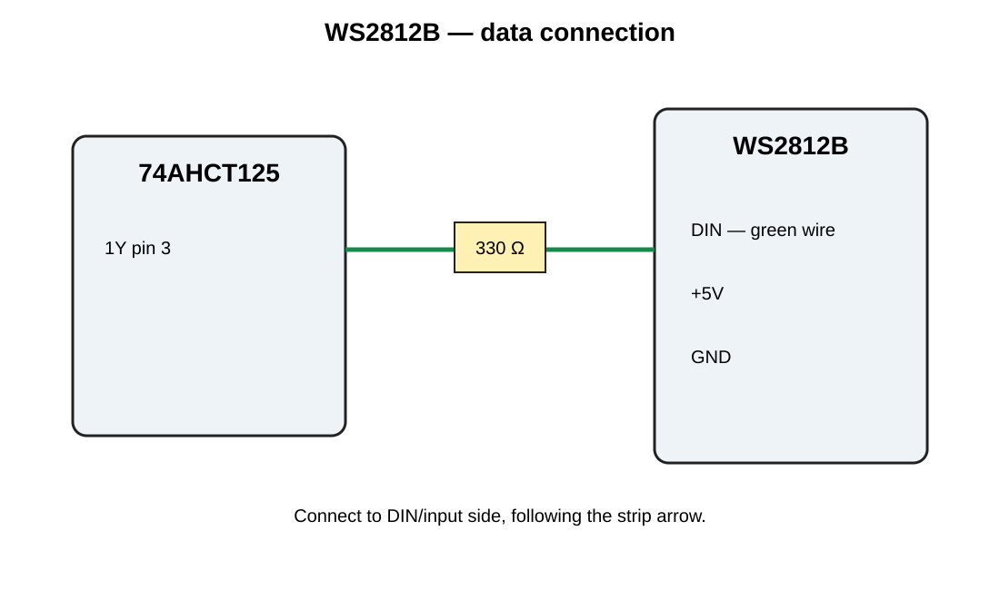
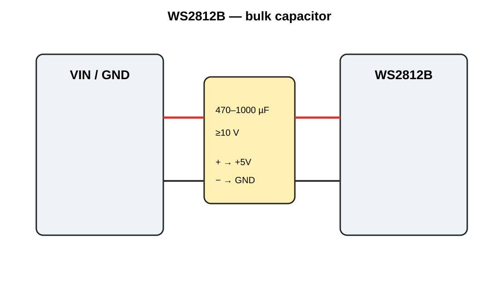
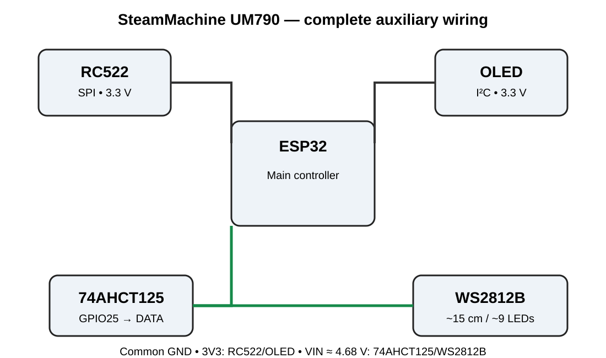

# SteamMachine UM790 — Hardware Connections

> **Status:** Definitive hardware connection reference  
> **Project:** SteamMachine-UM790  
> **Controller:** ESP32

This document is the current reference for the ESP32, RC522, OLED, 74AHCT125 and WS2812B wiring.

## 1. ESP32 pin allocation

| ESP32 | Function |
|---:|---|
| GPIO5 | RC522 SDA/SS |
| GPIO18 | RC522 SCK |
| GPIO19 | RC522 MISO |
| GPIO23 | RC522 MOSI |
| GPIO27 | RC522 RST |
| GPIO21 | OLED SDA |
| GPIO22 | OLED SCL |
| GPIO25 | WS2812B data source |
| 3V3 | RC522 + OLED supply |
| VIN (~4.68 V measured) | 74AHCT125 + WS2812B supply |
| GND | Common ground |

## 2. ESP32 → RC522

| RC522 | ESP32 |
|---|---|
| 3.3V | 3V3 |
| GND | GND |
| SDA / SS | GPIO5 |
| SCK | GPIO18 |
| MOSI | GPIO23 |
| MISO | GPIO19 |
| RST | GPIO27 |

**Do not connect the RC522 to 5 V.**



## 3. ESP32 → OLED

| OLED | ESP32 |
|---|---|
| VCC | 3V3 |
| GND | GND |
| SDA | GPIO21 |
| SCL | GPIO22 |



## 4. ESP32 → 74AHCT125 → WS2812B

Only channel 1 of the 74AHCT125 is used.

| 74AHCT125 | Connection |
|---:|---|
| Pin 14 — VCC | ESP32 VIN (~4.68 V measured) |
| Pin 7 — GND | Common GND |
| Pin 2 — 1A | ESP32 GPIO25 |
| Pin 1 — /1OE | GND |
| Pin 3 — 1Y | 330 Ω → WS2812B DIN |

Data path:

`GPIO25 → 74AHCT125 1A → 74AHCT125 1Y → 330 Ω → WS2812B DIN`



## 5. 74AHCT125 decoupling

Fit **one 100 nF ceramic capacitor** directly between:

- Pin 14 (VCC)
- Pin 7 (GND)

The capacitor has no polarity and should be physically close to the IC.



## 6. WS2812B

The project uses approximately **15 cm of strip (~9 LEDs)**.

The current strip wiring has been checked and the **green wire is DIN/data**.

| WS2812B | Connection |
|---|---|
| +5V | ESP32 VIN (~4.68 V measured) |
| DIN | 330 Ω from 74AHCT125 1Y |
| GND | Common GND |

Follow the arrow printed on the strip and connect to its **DIN/input side**.



## 7. WS2812B bulk capacitor

Fit **470–1000 µF electrolytic, rated ≥10 V**, close to the beginning of the strip.

- Capacitor `+` → WS2812B +5V
- Capacitor `−` → WS2812B GND



## 8. Complete wiring



### Common ground

All ESP32-controlled electronics share GND:

- RC522 GND
- OLED GND
- 74AHCT125 GND
- WS2812B GND

## 9. UM790 power-button interface

The ESP32 **does not power the UM790**.

The project button interfaces with the **original UM790 power-button contacts**. Do not connect ESP32 VIN or 3V3 directly to the UM790 power-button supply circuitry.

## 10. Components

| Qty | Component | Purpose |
|---:|---|---|
| 1 | 74AHCT125 | 3.3 V → 5 V logic buffer |
| 1 | 330 Ω resistor | WS2812B DIN series resistor |
| 1 | 100 nF ceramic capacitor | 74AHCT125 decoupling |
| 1 | 470–1000 µF electrolytic ≥10 V | WS2812B supply smoothing |
| ~15 cm | WS2812B strip | Front lighting |

## 11. Verification checklist

- [ ] RC522 at 3.3 V.
- [ ] OLED at 3.3 V.
- [ ] VIN measured at approximately 4.68 V.
- [ ] 74AHCT125 pin 14 → VIN.
- [ ] 74AHCT125 pin 7 → GND.
- [ ] 100 nF between pins 14 and 7.
- [ ] Pin 1 (/1OE) → GND.
- [ ] GPIO25 → pin 2 (1A).
- [ ] Pin 3 (1Y) → 330 Ω → WS2812B DIN.
- [ ] WS2812B green wire confirmed as DIN.
- [ ] WS2812B polarity checked.
- [ ] 470–1000 µF polarity checked.
- [ ] Common GND checked.
- [ ] Unused 74AHCT125 channels must not have floating inputs; finalize their connections before permanent assembly.

## 12. Firmware pin reference

```python
RC522_SS   = 5
RC522_SCK  = 18
RC522_MOSI = 23
RC522_MISO = 19
RC522_RST  = 27

OLED_SDA = 21
OLED_SCL = 22

WS2812B_DATA = 25
```

This pinout must remain synchronized with `07_Hardware_Specification.md`, `08_Software_API.md`, `09_Coding_Standards.md`, `10_Test_Plan.md`, `11_Assembly_Manual.md` and `06_Development_Roadmap.md`.

