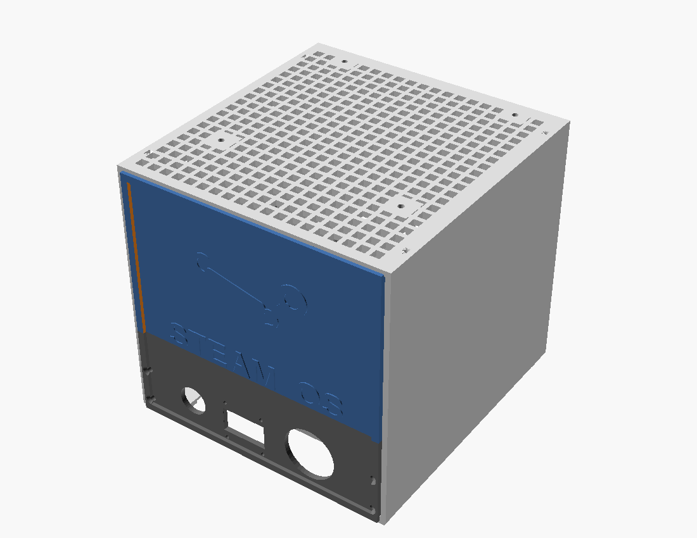
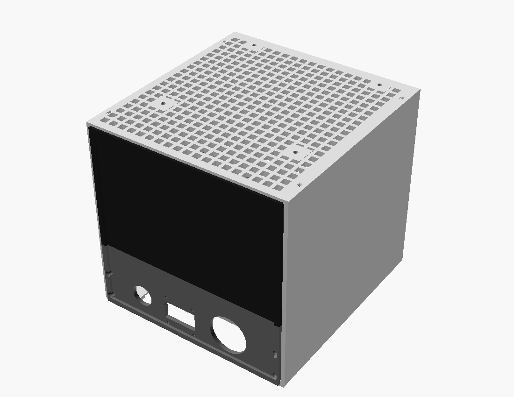
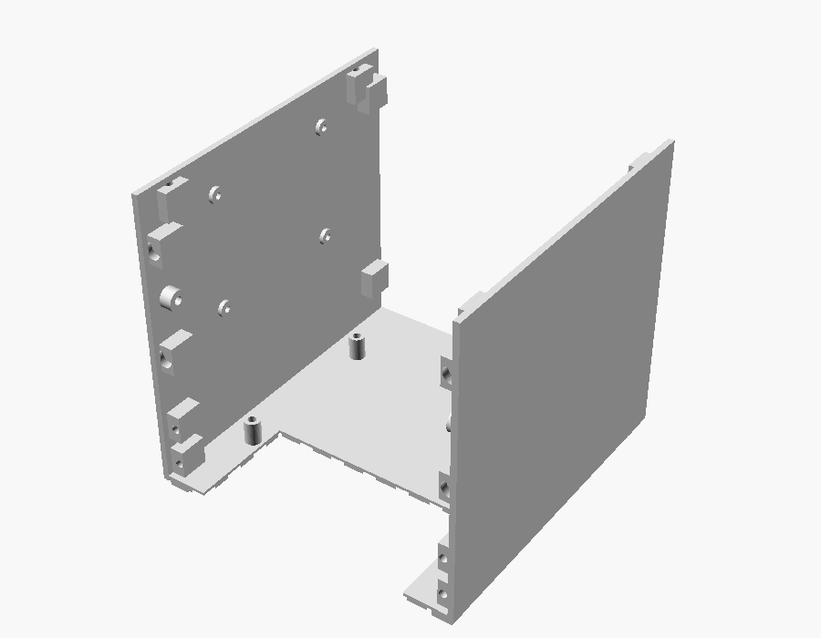
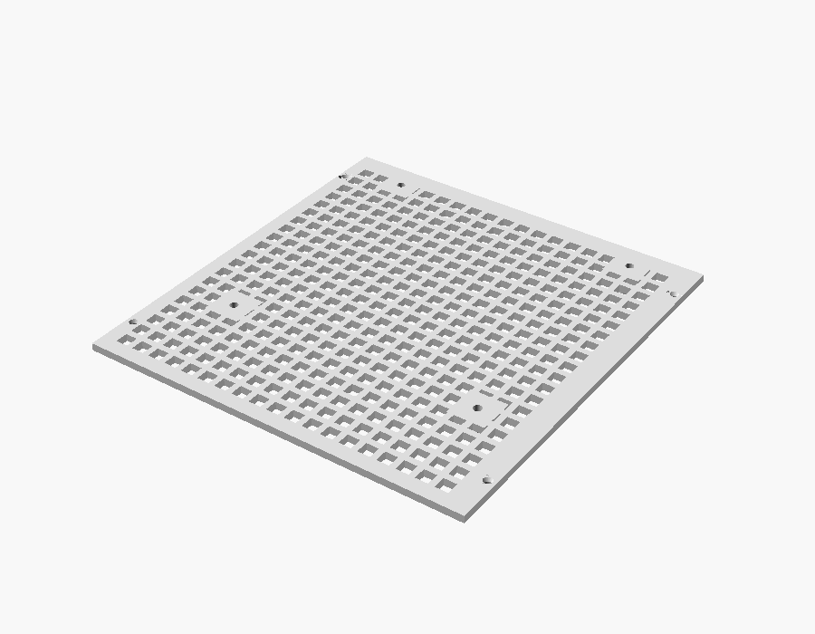
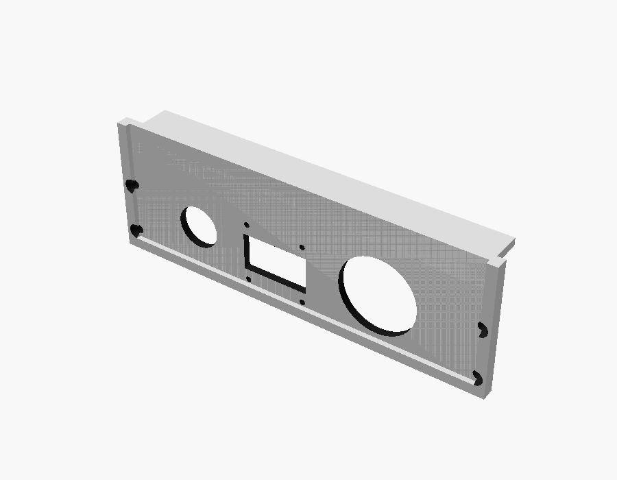
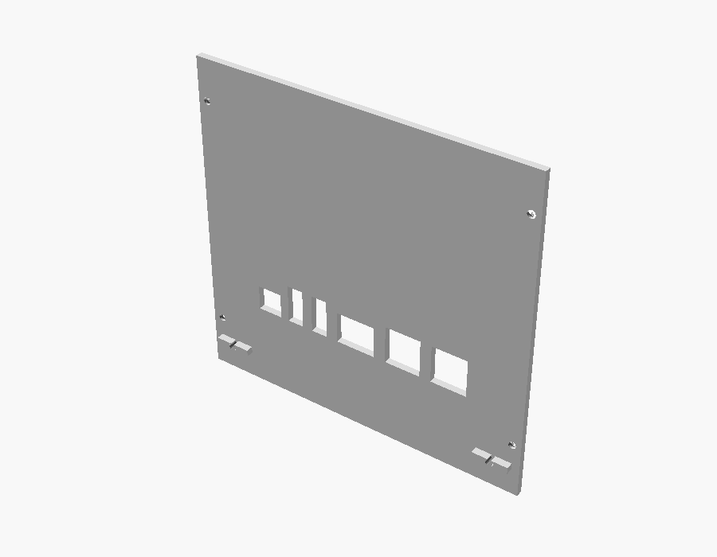
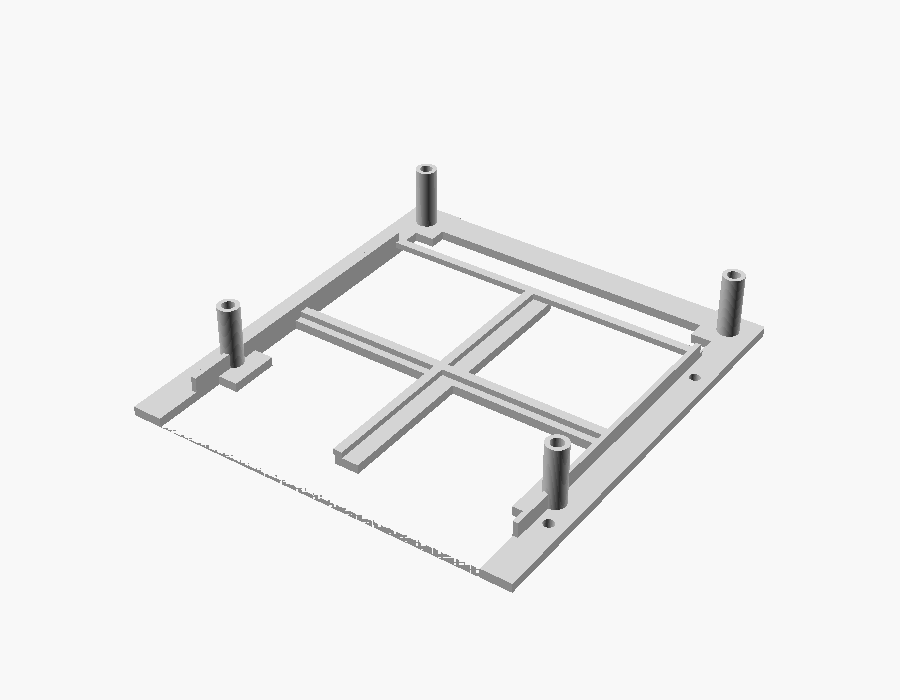

# SteamMachine-UM790
Proyecto de Steam Machine casera funcional
Diseño de carcasa 3D personalizada para convertir un mini PC **Minisforum UM790** en una Steam Machine compacta orientada a gaming, emulación y uso multimedia.

Proyecto desarrollado en **OpenSCAD**, con piezas preparadas para impresión 3D. Incluye también el firmware del ESP32 y el software que corre en el mini PC.

> 👉 **¿Quieres montarlo tú mismo?** Empieza por [`GUIA_INICIO.md`](GUIA_INICIO.md) — guía completa paso a paso, sin conocimientos previos necesarios.

---

## 📷 Galería

Renders reales generados directamente desde el diseño paramétrico
actual del proyecto (OpenSCAD), no maquetas ni imágenes genéricas —
se regeneran cada vez que cambia el CAD, así que siempre reflejan el
estado real de las piezas.

### Carcasa montada, con distintos anagramas de panel NFC

| Steam | RetroBat | En blanco |
|---|---|---|
|  |  |  |

El panel NFC frontal es intercambiable — el ensamblaje es siempre el
mismo, solo cambia la pieza pequeña con el anagrama (ver `openscad/parts/03_panels/nfc_panel_*.scad`
y el sistema de impresión en dos piezas de `STL/Anagramas/`). El
anagrama del panel Zombies (`STL/Anagramas/Gung.stl`) todavía no tiene
un `.scad` paramétrico propio como los de arriba —está modelado
directamente como STL suelto—, así que de momento no aparece en este
render conjunto.

### Piezas por separado

| Chasis | Panel superior (rejilla) |
|---|---|
|  |  |

| Panel inferior (frontal, con OLED/botón/USB) | Panel trasero |
|---|---|
|  |  |

| Bandeja interior |
|---|
|  |

---

## 📌 Características

- Carcasa modular diseñada específicamente para UM790.
- Diseño paramétrico en OpenSCAD.
- Piezas separadas para facilitar la impresión.
- Optimizada para impresoras FDM.
- Preparada para montaje con tornillería estándar.
- Ventilación integrada para mantener temperaturas adecuadas.
- Diseño orientado a estética tipo consola Steam Machine.
- Sistema de paneles frontales intercambiables.
- Identificación NFC para cambio de modo.
- Panel NFC **Apagar**: apagado ordenado del equipo (evita cortar la corriente de golpe).
- Caja con tapa para guardar los paneles NFC cuando no están puestos.
- Diseño preparado para expansión con nuevos paneles.

## 🎮 Sistema de paneles frontales NFC

Uno de los elementos principales del diseño es el sistema de paneles frontales intercambiables mediante identificación NFC.

La carcasa permite utilizar diferentes paneles frontales personalizados, cada uno asociado a una función, sistema o configuración concreta mediante etiquetas NFC integradas.

### Funcionamiento

Cada panel frontal incorpora:

- Un diseño físico específico según la temática.
- Una etiqueta NFC integrada en el propio panel.
- Identificación automática al acercar el dispositivo lector NFC.
- Posibilidad de lanzar diferentes configuraciones o aplicaciones según el panel utilizado.

Ejemplos de uso:

- 🎮 Panel Steam Machine → inicia Steam Big Picture.
- 🕹️ Panel Arcade → inicia RetroDECK / RetroArch.
- 🧟 Panel Zombies → THE HOUSE OF THE DEAD: Remake / THE HOUSE OF THE
  DEAD 2: Remake (nativos de Steam vía Proton — pensado para jugarse
  con Wiimote como pistola, integración pendiente).
- ⚙️ Panel Configuración → acceso a herramientas del sistema.
- 🎵 Panel Multimedia → reproducción multimedia.
- ⏻ Panel Apagar → apaga el equipo de forma ordenada (ver más abajo).

---

## 🔌 Integración NFC

El sistema está pensado para trabajar con un lector NFC conectado al equipo.

Flujo de funcionamiento:

Las etiquetas NFC pueden programarse para ejecutar diferentes acciones:

- Abrir aplicaciones.
- Ejecutar scripts.
- Cambiar perfiles.
- Lanzar emuladores.
- Seleccionar diferentes modos de uso.

---

## ⏻ Apagado ordenado con el panel Apagar

Cortar la corriente de golpe puede dejar Bazzite sin arrancar (por
ejemplo, en el prompt `grub>`; ver [`GUIA_INICIO.md`](GUIA_INICIO.md),
solución de problemas). Para evitarlo hay un panel **Apagar**: se coloca como
cualquier otro y, al pulsar el botón, el equipo se apaga con
`systemctl poweroff` (systemd cierra servicios y desmonta discos antes
de cortar).

1. Coloca el panel Apagar → la OLED muestra `APAGAR EQUIPO` y los LEDs
   se ponen rojos. **Todavía no se ha apagado nada.**
2. Pulsa el botón → la OLED pasa a `Apagando...`, los LEDs se
   funden a negro y el equipo se apaga en unos segundos.

Son dos gestos a propósito: un roce del tag no apaga la máquina. Si el
sistema rechaza el apagado (p. ej. una actualización en curso), la OLED
muestra `Error al apagar` y el equipo sigue encendido. Detalles en
[`docs/12_Profile_System.md`](docs/12_Profile_System.md).

---

## 🧩 Diseño modular

Los paneles frontales están diseñados para poder sustituirse fácilmente:

- Sistema de fijación común.
- Compatibilidad con futuros diseños.
- Personalización mediante impresión 3D.
- Posibilidad de crear paneles temáticos.

El objetivo es que la SteamMachine pueda cambiar de función simplemente sustituyendo el panel frontal.

---

## 🖨️ Impresión 3D

### Impresora recomendada

Compatible con:

- Anycubic Kobra X
- Impresoras FDM con volumen similar

### Material: PETG

**Todas las piezas se imprimen en PETG.** El PLA (incluido el PLA+) se
deforma con la temperatura: la carcasa envuelve un mini PC que expulsa
aire caliente y el PLA se ablanda alrededor de los 55-60 °C, mientras
que el PETG aguanta hasta unos 70-80 °C (valores orientativos; varían
según la marca de filamento). Con PLA se ha comprobado que las piezas
se deforman en uso real.

- **PETG**: todas las piezas de la carcasa, los paneles frontales y los
  soportes. La caja de paneles NFC (`docs/14_Caja_Paneles_NFC.md`) no
  recibe calor de la máquina, así que PLA sería válido para ella, pero
  se recomienda PETG por coherencia.
- **PLA / PLA+**: solo para pruebas rápidas de encaje. No dejes una
  pieza de PLA montada dentro del equipo.
- **ABS/ASA**: opcional, si quieres más margen térmico todavía (más
  difícil de imprimir: cerramiento y ventilación).
- **Piezas a dos filamentos** (panel inferior, difusor LED translúcido):
  los dos filamentos deben ser PETG. Mezclar PLA y PETG en la misma
  pieza da una unión mala entre capas.
- **Anagramas pegados con Loctite**: el cianoacrilato agarra algo peor
  sobre PETG que sobre PLA. Lija ligeramente las dos caras, desengrasa
  con alcohol isopropílico y pega; si aun así se despega, usa epoxi
  de 5 minutos.
- Las holguras y encajes del diseño se ajustaron con PLA+. Con PETG
  revisa los encajes antes de montar (ver `docs/14_Caja_Paneles_NFC.md`
  para la caja y la tapa).

### Parámetros orientativos

- Altura de capa: 0,20 mm
- Paredes: 3-4 perímetros
- Relleno: 15-30 %
- Soportes: según pieza
- Temperaturas típicas de PETG: boquilla 230-250 °C, cama 70-85 °C,
  ventilador de capa bajo (30-50 %). Parte del perfil PETG de tu
  marca de filamento y ajusta; los puentes salen algo peor que en PLA.

---

## 📂 Estructura del proyecto

```
SteamMachine-UM790/
│
├── GUIA_INICIO.md          Guía paso a paso para montarlo todo, de cero
├── CHANGELOG.md            Historial completo de decisiones de diseño
│
├── openscad/               Diseño 3D paramétrico
│   ├── parts/               Piezas por imprimir (chasis, paneles...)
│   └── reference/            Componentes y posiciones del ensamblaje
├── STL/                    STL listos para imprimir
│   ├── caja_nfc_panel_*.stl  Caja + tapa para guardar los paneles NFC
│   └── Anagramas/            Panel NFC en blanco + anagramas sueltos,
│                              para imprimir por separado y pegar con
│                              Loctite (reduce el tiempo de impresión
│                              de ~6h a ~1h frente a la pieza única)
│
├── firmware/                Firmware del ESP32 (C++, PlatformIO)
├── software/                 Core en Python — corre en el mini PC
│
├── Hardware/                 Conexiones eléctricas y cableado
└── docs/                     Documentación técnica detallada (01 a 14)
```

---

## 🛠️ Software utilizado

- OpenSCAD  
  https://openscad.org/

- Cura / OrcaSlicer / PrusaSlicer para laminado.
- PlatformIO (VS Code) para el firmware del ESP32.
- Python 3 para el Core que corre en el mini PC.

---

## ⚙️ Personalización

El diseño utiliza parámetros editables para modificar:

- Dimensiones generales.
- Posición del equipo.
- Grosor de paredes.
- Ventilación.
- Anclajes.
- Compatibilidad con diferentes accesorios.

Archivo principal: `openscad/00_parametros.scad`

---

## 🚀 Estado del proyecto

🟢 Hardware montado y en pruebas

### Completado

- [x] Diseño mecánico completo (carcasa, paneles, canal LED, fijación OLED).
- [x] Hardware montado (ESP32, RC522, OLED, barra LED, HUB USB).
- [x] Firmware del ESP32 escrito, compilado y flasheado en hardware real.
- [x] Software Core (Python) escrito, con tests unitarios.
- [x] Probado en hardware real: lectura NFC, barra LED, pulsador frontal, pantalla OLED, recuperación tras reinicio del ESP32.
- [x] Core (Python) probado de extremo a extremo contra el ESP32 real: detecta panel, reacciona OLED/LEDs y responde al botón lanzando la plataforma correspondiente.
- [x] Guía de inicio completa para montarlo desde cero (`GUIA_INICIO.md`).
- [x] Panel NFC **Apagar** (apagado ordenado, `docs/12_Profile_System.md`): implementado en el Core con tests; anagrama `STL/Anagramas/Apagar.stl`.
- [x] Caja con tapa para guardar hasta 6 paneles NFC (`docs/14_Caja_Paneles_NFC.md`).
- [x] Publicación de STL definitivos actualizados (incluye `STL/Anagramas/` — panel en blanco + anagramas sueltos para pegar con Loctite).

### Pendiente

- [ ] Panel Apagar: escribir el tag NFC, poner su UID real en `software/config/panel_database.json` (ahora `UID_APAGAR_PENDIENTE`) y probar el apagado en el hardware real (`docs/10_Test_Plan.md`, T065).
- [ ] Reimprimir en PETG las piezas que estén en PLA y validar la temperatura tras 24 h (`docs/10_Test_Plan.md`, T022).
- [ ] Wiimote como pistola para el panel Zombies (Bluetooth + barra de sensor IR).
- [ ] UID de tag NFC real para el panel Zombies - HOTD 2 Remake.

Ver `docs/10_Test_Plan.md` para el detalle de cada prueba realizada, y
`docs/06_Development_Roadmap.md` para el estado por fases.

---


## 🤝 Contribuciones

Las mejoras, modificaciones y sugerencias son bienvenidas.

Si realizas una modificación o adaptación, puedes abrir un Pull Request.


---

## Autor

Pep Ventura

Proyecto creado para uso personal y compartido con la comunidad maker.

## Licencia

Este proyecto está bajo la **Licencia MIT**. Esto significa que puedes usar, modificar y distribuir el código libremente, incluso para fines comerciales. 

Para más detalles, consulta el archivo [LICENSE](LICENSE) incluido en este repositorio.

