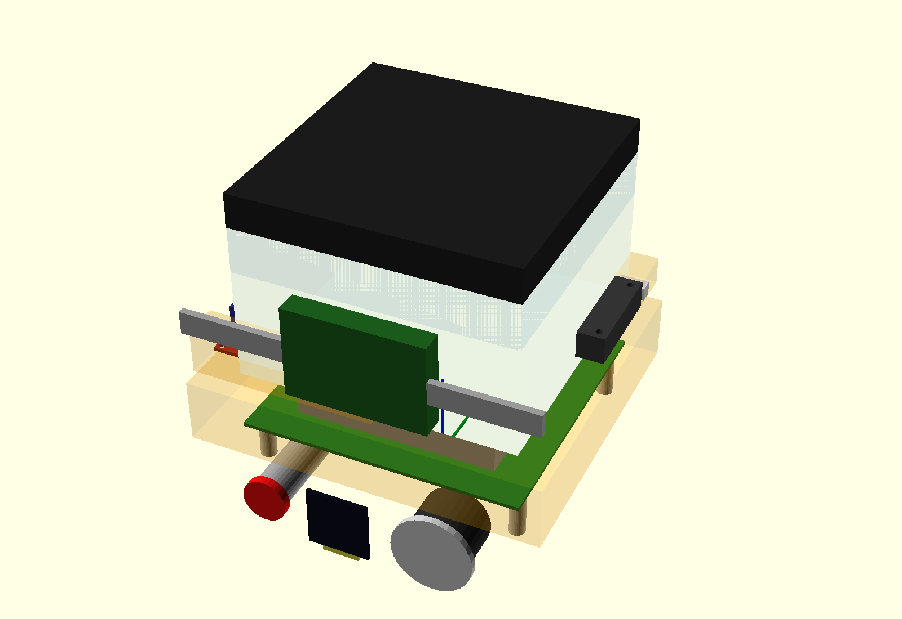
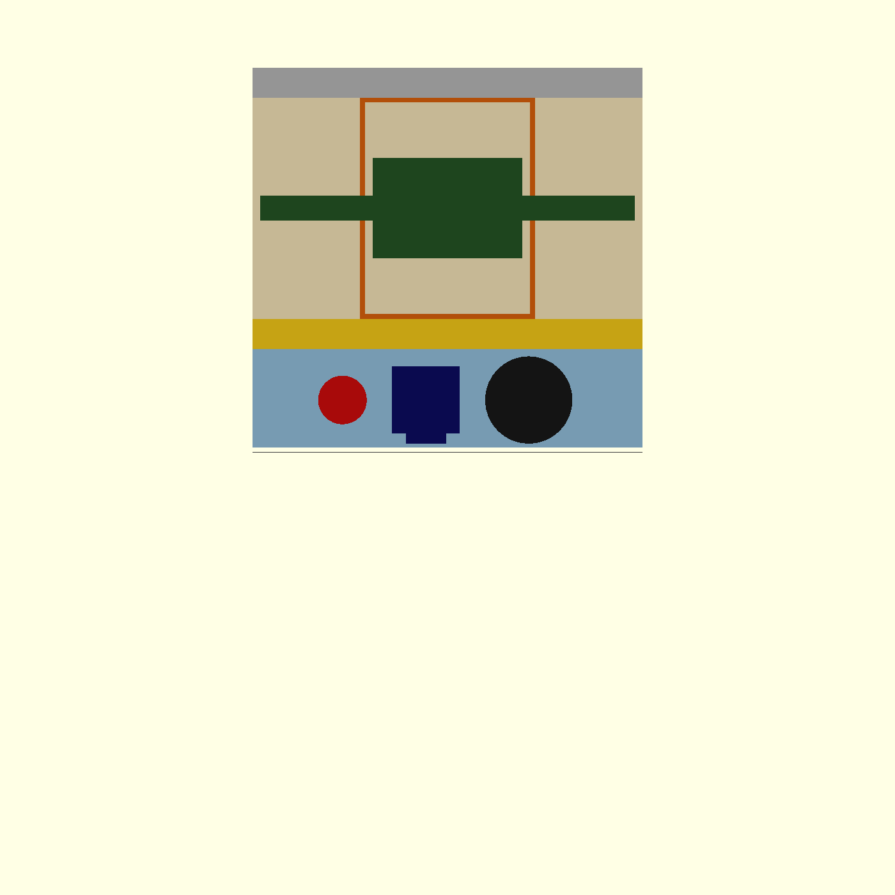

# SteamMachine UM790
## Virtual Assembly Report — v1
Version: 2.0
Status: Definitivo (confirmado por el usuario)
Date: 2026-08-03

Informe de resultados de `openscad/reference/virtual_assembly_v1.scad`,
el ensamblaje virtual completo construido **antes** de diseñar el
bastidor definitivo. Verifica que ningún componente colisiona, que el
cableado tiene espacio, que el ventilador no interfiere con nada, que
los conectores traseros son accesibles y que el HUB USB puede llegar a
los USB frontales con cables cortos.

Complementa (no sustituye) `docs/02_Mechanical_Layout.md` (DIM v1.0,
Approved), que sigue siendo la referencia de criterios de diseño.

**Todas las decisiones de este documento han sido confirmadas por el
usuario el 2026-08-03** y se dan por definitivas para el ensamblaje
virtual v1. El diseño del bastidor (`openscad/parts/02_chassis`) puede
comenzar a partir de aquí.

---

## 1. Resultado final de la comprobación de colisiones

```
Pares sin colisión : 28 / 28
Pares en colisión  : 0
Errores de render  : 0

AVISOS (volúmenes de seguridad de cableado, no bloqueantes):
  - rc522InstanceKeepout <-> esp32InstanceBody (12 triángulos)
  - esp32InstanceKeepout <-> rc522InstanceBody (24 triángulos)
```

Reproducible con:
```bash
cd openscad/reference/checks
python3 run_collision_checks.py
```

Los dos avisos son solo una indicación de que el cableado entre el
RC522 y el ESP32 pasa cerca uno del otro (ambos en el lateral
izquierdo, por diseño) — no es una colisión mecánica dura, solo un
punto a cuidar al enrutar los cables en el montaje real.


*Ensamblaje virtual sin la carcasa, estado definitivo.*


*Alzado frontal: panel inferior fijo (azul), barra LED (amarillo), panel NFC (beige/naranja), margen fijo (gris).*

---

## 2. Decisiones confirmadas por el usuario (2026-08-03)

| Decisión | Valor | Nota |
| --- | --- | --- |
| Altura de separadores del UM790 | **20 mm** | `um790_standoff_height` en `00_parametros.scad` |
| Posición X del pulsador | **-42 mm** | esquiva el poste de anclaje izquierdo de la PCB |
| Posición X del USB empotrable | **+32,5 mm** | esquiva el poste de anclaje derecho de la PCB |
| USB frontal | **1 unidad de doble puerto** (no 2 independientes) | componente real localizado por el usuario; cables flexibles al HUB |
| Ancho real de la tira LED | **10 mm** | + 1 mm de margen de canal a cada lado = 12 mm total |
| Tamaño del panel inferior fijo | **mínimo imprescindible: 39,5 mm** | envolvente del clúster + 3 mm de margen |
| Tamaño del panel NFC extraíble | **máximo posible: 88,5 mm** | todo el hueco restante hasta el margen superior fijo |

Estas decisiones son la razón por la que el resultado final es 28/28
sin colisión — se llegó a este estado a través de varias iteraciones
(ver sección 4, historial).

---

## 3. Las tres zonas del panel frontal (definitivo)

| Zona | Z (mm) | Alto | Contenido |
| --- | --- | --- | --- |
| 1 — Panel inferior fijo | 0 – 39,5 | 39,5 mm | Pulsador (X=-42), OLED (X=-8,6), USB doble (X=32,5) — fila única, misma altura Z=19 |
| 2 — Barra LED | 39,5 – 51,5 | 12 mm | Impresa en la MISMA pieza que el panel inferior, 2º filamento (Anycubic Kobra X) |
| 3 — Panel NFC extraíble | 51,5 – 140 | 88,5 mm | RC522 centrado a media altura (Z=95,75), separado 3 mm del panel |
| — Margen fijo del chasis | 140 – 152 | 12 mm | No es un panel; parte del chasis principal fijo |

Comprobación de consistencia incorporada: `assembly_positions.scad`
calcula estas cuatro zonas de abajo hacia arriba (a partir del
clúster) de forma independiente al valor de `nfc_panel_height` fijado
en `00_parametros.scad`, y avisa (`front_panel_zones_consistent`) si
alguna vez dejan de coincidir — por ejemplo, si se cambia el tamaño de
algún componente del clúster inferior sin actualizar
`nfc_panel_height`.

Vista de alzado reproducible con:
```bash
cd openscad/reference
openscad front_panel_view.scad
```
(`front_panel_view.scad` es una ayuda visual de proyección plana, NO
una pieza imprimible ni un plano acotado.)

---

## 4. Historial de esta verificación (resumen)

1. **Primera pasada** (12 mm de separadores, posiciones de
   `front_layout.scad` sin verificar): 26/28 — colisión real entre el
   pulsador/USB y la PCB del UM790, por falta de profundidad libre
   tras el panel frontal (~18,45 mm disponibles frente a 55 mm/28 mm
   necesarios).
2. **Elevar el UM790 a 20 mm sin más**: seguía en 26/28 — el problema
   se trasladaba de la PCB a los postes de anclaje de la propia PCB
   (no modelados en la primera versión de `um790.scad`).
3. **Postes de anclaje añadidos + pulsador/USB reposicionados en X**
   para esquivarlos: 28/28.
4. **USB real localizado por el usuario** (unidad doble, cables
   flexibles): permitió intentar una fila única con el OLED, que en
   el primer intento con 2 USB independientes no cabía (solapes de
   5,88 mm). Con la unidad doble sí cupo: 28/28, panel más compacto.
5. **Corrección de un fallo de visualización**: la primera vista de
   alzado frontal tapaba las zonas de color con un contorno opaco
   dibujado encima; corregido invirtiendo el orden de dibujado.
6. **Tira LED con dato real (10 mm)**: sustituyó el hueco de
   conveniencia (25 mm) inventado en el primer intento. De paso se
   detectó y corrigió una colisión de nombres con un parámetro
   `led_bar_height` ya existente en el proyecto (usado por
   `front_panel.scad` y `front_layout.scad`, valor antiguo 8 mm).
7. **Panel inferior mínimo / NFC máximo**: cálculo de abajo hacia
   arriba a partir de la envolvente real del clúster; `nfc_panel_height`
   pasa de 70 mm a 88,5 mm.
8. **Confirmación del usuario** (este documento): separadores a
   20 mm y posiciones X del pulsador/USB, definitivas.

---

## 5. Parámetros añadidos o modificados en `00_parametros.scad`

Solo se han modificado tres valores YA EXISTENTES en el archivo (el
resto de cambios son parámetros nuevos, añadidos sin tocar nada
más):

| Parámetro | Antes | Ahora | Motivo |
| --- | --- | --- | --- |
| `led_bar_height` | 8.0 (estimado) | `led_bar_strip_width + 2*led_bar_margin` = 12.0 (dato real) | Dato real proporcionado por el usuario |
| `nfc_panel_height` | 70.0 | 88.5 | Maximizado tras minimizar el panel inferior (petición del usuario) |
| `um790_standoff_height` | 12.0 (dato inicial de esta tarea) | 20.0 | Confirmado por el usuario para resolver la colisión con la PCB/postes |

**Importante**: `led_bar_height` y `nfc_panel_height` los usan
también `openscad/parts/03_panels/front_panel.scad` y
`front_layout.scad` (piezas ya construidas, aunque no impresas ni
finalizadas). Este cambio afecta a esos dos ficheros la próxima vez
que se rendericen.

---

## 6. Discrepancia pendiente (fuera del alcance de esta tarea)

Sigue habiendo dos valores de altura de separadores del UM790 sin
reconciliar con el confirmado aquí (20 mm):

| Fuente | Valor |
| --- | --- |
| `openscad/parts/01_bandeja/posts.scad` (bandeja física ya construida) | 6 mm |
| `docs/02_Mechanical_Layout.md` (DIM v1.0, Approved) | 8 mm |
| **Este ensamblaje virtual v1 (confirmado)** | **20 mm** |

Antes de imprimir la bandeja física o dar el DIM por definitivo en
este punto, hay que decidir cuál de los tres prevalece — lo más
probable, dado todo lo verificado aquí, es actualizar `posts.scad` y
el DIM a 20 mm, pero esa decisión no se ha tomado todavía y queda
fuera del alcance de este ensamblaje virtual (que solo verifica,
no modifica piezas ya construidas).

---

## 7. Siguientes pasos

1. Reconciliar la altura de separadores en `posts.scad` y
   `docs/02_Mechanical_Layout.md` con el valor confirmado (20 mm) —
   pendiente, no bloqueante para empezar el bastidor.
2. Actualizar `openscad/parts/03_panels/front_panel.scad` y
   `front_layout.scad` con las nuevas posiciones y tamaños (panel
   inferior mínimo, barra LED real, USB doble, panel NFC máximo) —
   siguen con su diseño anterior, no reflejan todavía este resultado.
3. Con esto, **empezar el diseño del bastidor**
   (`openscad/parts/02_chassis`), reutilizando directamente las
   posiciones ya validadas de
   `openscad/reference/components/assembly_positions.scad`.
